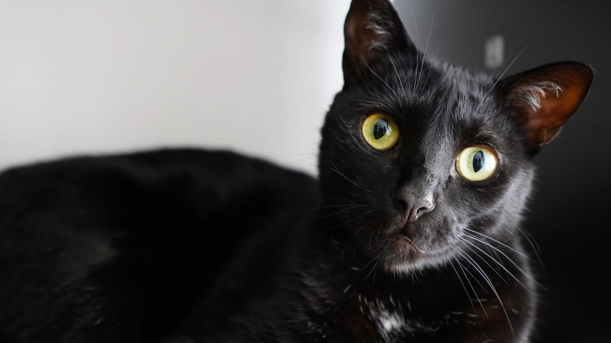

# Mi nombre es Laura Valentina Rodríguez Ortegón
## _Soy del programa de Ingeniería de Sistemas_
### __*Voy en 7_mo semestre.*__

Algunos de los lenguajes de programación que sé son:
```
Java
Python
C 
R
SQL
Haskell
CSS
JAVASCRIPT
```

Me gustan las mascotas bastante; tenemos dos gatos y un perro en casa, sus nombres son:
- ✨Astro✨
- Pantro
- Turpial

El primero es el mio (Astro), una foto suya:



## Cosas que me gustan 
1. Dormir
2. El color azul 
3. El gato Doraemon
4. Stitch
5. Leer
6. Progranar 
7. Escuchar música
8. Los caballos
9. El baloncesto
10. El Voleibol
11. Comer
12. El dulce

> Mi aspiración para crecer como persona y profesional es terminar la carrera de ingeniería 
> de sistemas y, con ello, ir a vivir a otro lugar del mundo para conocer más de la cultura 
> de otros países.

[](https://co.pinterest.com/pin/498914464943811650/)
